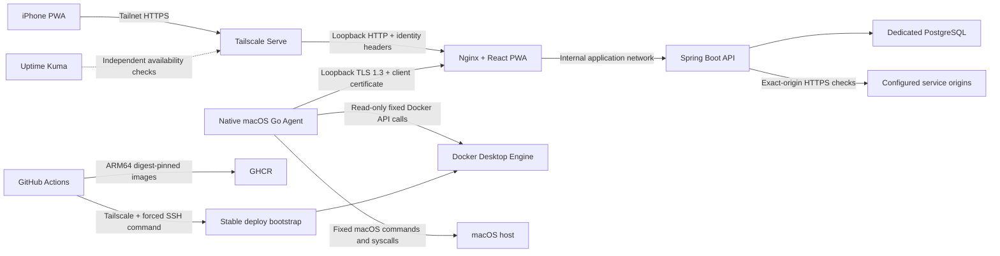

# Architecture

## Scope and support boundary

HomeOps is a single-administrator dashboard for an Apple Silicon Mac that runs Docker Desktop. The source can be forked and self-hosted, but the supported ingress is a private tailnet. Internet exposure, Funnel, multi-tenant isolation, and arbitrary Docker or shell input are not supported.

The current milestone remains read-only for host and container operations. It implements host and container inventory, HMAC-authenticated deployment/backup ingestion, exact-origin HTTP service checks, incident state transitions, bounded check-result retention, and a paginated Activity timeline. These operational-history inputs are fail-closed until their operator-managed secret or origin allowlist is configured. Notifications, logs, and container control remain later milestones.

## Runtime topology

The API and database are never given the Docker socket. Only the native Agent can reach it. The Agent has no inbound listener and does not accept a command name, path, container identifier, or shell fragment from the API.

## Why a native Agent

A Linux container on Docker Desktop observes its container or the Docker Linux VM, not the macOS host. OSHI inside the API container therefore cannot be the source for actual Mac CPU, memory, disk, or uptime.

The Agent currently gathers:

- CPU utilization from the second sample of a fixed `/usr/bin/top` invocation;
- total memory from `sysctl` and used memory from fixed `vm_stat` fields;
- root filesystem capacity through `statfs`;
- uptime from `kern.boottime`;
- Docker version, container list, a bounded subset of container inspect fields, and non-streaming CPU/memory stats over the configured Unix socket.

It does not collect CPU temperature, per-interface network traffic, environment variables, mounts, raw inspect JSON, or unbounded logs. Temperature is excluded because a stable non-privileged public macOS API was not established. The Agent calculates Docker CPU from two consecutive Agent-owned cumulative samples, so the first sample after Agent start is unavailable. A missing stat is represented as unavailable rather than zero, and Docker CPU may exceed 100 percent when a container uses more than one logical CPU.

## Trust boundaries

There are two independent ingress paths:

1. The browser path is bound to host loopback and expected to be reached only through Tailscale Serve. Nginx forwards Tailscale identity headers and clears the Agent verification header.
2. The Agent path is a separate loopback TLS listener. Nginx requires a client certificate and creates the internal verification header only after successful mutual TLS.

The internal `application` network is the east-west path shared by Web, API, and PostgreSQL; migration joins only that network. Web also attaches to a non-internal `ingress` bridge because Docker Desktop host-published ports need that path for the loopback/Tailscale Serve browser entry. API separately attaches to a non-internal `egress` bridge solely for exact-origin HTTPS service checks. `ingress` and `egress` are names, not directional controls: Docker's `internal: true` property is what removes a network's external default route. A browser cannot directly reach the API or database port. The Web image serves static files and Nginx reverse proxy routes only; it has no general outbound application feature, but its ingress attachment does not provide Docker-level outbound blocking. Configured API check targets must pass the operator-provided `SafeServiceUrlPolicy` allowlist. Stronger Web egress restrictions require a host firewall, proxy, or separate edge network policy as future work. A local process that can reach the loopback Web port may spoof Tailscale headers; HomeOps does not claim to protect against a compromised macOS account. Keep the Mac account, Docker Desktop, and tailnet account strongly protected.

## Authentication and refresh model

Tailscale identity plus an exact login allowlist is the primary authentication mechanism. Spring Security stores the resulting administrator authentication in a server-side JDBC session, but revalidates the current Serve identity on every API request and clears the context when the header is missing or no longer allowed. Browser requests are same-origin, session cookies are `Secure`, `HttpOnly`, and `SameSite=Strict` in production, and state-changing browser APIs must use CSRF tokens.

Status uses five-second HTTP polling while the page is visible. TanStack Query refetches after focus and network recovery. Polling stops while the PWA is hidden. This is more predictable on iOS than keeping an SSE connection alive in the background. A future bounded log tail may use SSE without changing status polling. WebSocket is not part of the current design.

## Data ownership

HomeOps has a dedicated PostgreSQL instance and volume. It does not share a database with another project. The current implementation persists one-minute host metric aggregates, Agent liveness, and a bounded processed-snapshot idempotency ledger, while the latest detailed container snapshot remains in API memory. Container inventory responses include Agent freshness so a stopped Agent cannot leave old RUNNING or HEALTHY states presented as current.

The current deployment supports one API replica and one in-process service-check scheduler; distributed scheduler claims are not implemented. Incident creation nevertheless has a PostgreSQL partial unique index for each service's `OPEN` or `ACKNOWLEDGED` incident, so the maximum-one-active-incident invariant remains database-enforced even if concurrent callers race.

The default metric policy keeps one-minute aggregates for 30 days, about 43,200 rows for one Agent, and deletes only older aggregate rows in a daily transaction. Healthy service-check results default to seven days and failures to 30 days. Agent Activity records are written only on first connection or version change, never for every five-second snapshot. The schema also reserves normalized tables for notification attempts, control audit events, settings, and Spring sessions. JSONB is restricted to auxiliary metadata; searchable state and identity fields remain normal columns.

HomeOps does not store container logs, Docker inspect documents, `.env` content, credentials, or webhook URLs. `backup_run` describes backup results from other projects; it does not mean HomeOps automatically backs up its own database. A trusted script can submit a deployment or backup result only after it has a bounded-time HMAC signature; event keys make retried delivery idempotent and terminal state changes are rejected. Service-check targets must match an operator-provided exact HTTPS origin, redirects are not followed, and request timeouts are bounded.

## Uptime Kuma role

Uptime Kuma remains an independent availability monitor. It should own HTTP reachability and the existing email path. HomeOps owns actual Mac metrics, Docker inventory, deployments, backup-result metadata, incidents, and Discord-oriented operational events in later milestones.

HomeOps does not depend on an unofficial Uptime Kuma API. If both services run on the same Mac, neither can report a complete host outage from that Mac. An external heartbeat is optional and introduces cost, metadata disclosure, and a new dependency; it is not enabled by this repository.

## Failure behavior

- Agent delivery failure stores a bounded local snapshot spool and retries oldest first.
- A stale or missing Agent snapshot is shown as stale/offline, never healthy.
- API responses use `no-store`, and the service worker uses `NetworkOnly` for API GET requests.
- A deployment uses immutable API, Web, and runtime-config digests and verifies both application images carry the requested full-SHA revision label.
- Runtime configuration remains pending until application health succeeds.
- Migration failure stops before application cutover. Application health failure pulls and verifies the previous digest-pinned application before attempting it with the previous runtime configuration.

No live behavior in this document should be considered verified until the corresponding development, CI, Mac Agent, iPhone, and production acceptance gates have run.

## Initial resource envelope

The production example applies ceilings of 640 MiB to the API, 512 MiB to PostgreSQL, and 64 MiB to Web. The JVM heap defaults to 128–384 MiB, Hikari to five connections, and PostgreSQL to 20 connections with 128 MiB shared buffers. These are guardrails for a single-user server, not measured steady-state guarantees. Measure RSS, memory pressure, swap trend, collection duration, and existing service health before tightening them.

Agent collections run every five seconds with a 20-second collection deadline and at most 128 containers by default. The Go Agent has no `launchd` memory limit in the example; its real RSS and the cost of fixed `top` plus Docker stats remain an acceptance measurement.
