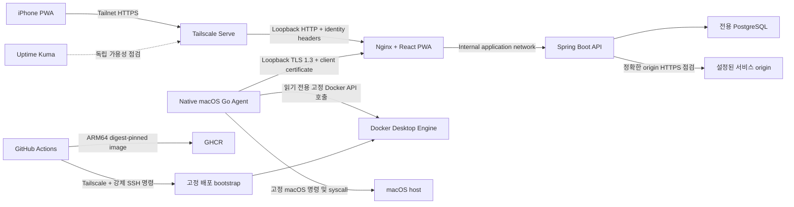

# 아키텍처

## 범위와 지원 경계

HomeOps는 Docker Desktop을 실행하는 Apple Silicon Mac용 단일 관리자 대시보드입니다. 소스를 fork하여 self-host할 수 있지만, 지원하는 ingress는 비공개 tailnet입니다. 인터넷 공개, Funnel, multi-tenant 격리, 임의 Docker 또는 shell 입력은 지원하지 않습니다.

현재 마일스톤에서 호스트와 컨테이너 작업은 읽기 전용입니다. 호스트·컨테이너 인벤토리, bounded metric history, freshness-aware Container Detail, explicit opt-in bounded/redacted Container Logs, HMAC 인증 배포/백업 수집, 정확한 origin HTTP 서비스 점검, 인시던트 상태 전환, 범위 제한 점검 결과 보존, 페이지네이션 Activity 타임라인을 구현합니다. 운영 이력 입력은 운영자가 관리하는 secret 또는 origin allowlist를 설정하기 전까지 fail closed하고, Container Logs는 fresh capability와 container별 exact opt-in이 없으면 fail closed합니다. Phase 4에는 dormant Discord outbox foundation, fail-closed service eligibility authority와 deployment·backup·incident·Agent lifecycle·Docker episode source producer가 있습니다. Global notification activation과 production Docker opt-in은 아직 수행하지 않습니다. 컨테이너 제어도 이후 마일스톤으로 남아 있습니다.

## 런타임 토폴로지

API와 데이터베이스에는 Docker socket을 절대 제공하지 않습니다. 이를 접근할 수 있는 것은 native Agent뿐입니다. Agent는 inbound listener가 없고 명령 이름, Docker path/query, shell fragment를 받지 않습니다. Container Logs work는 fixed DTO의 12자리 short ID, allowlisted tail과 absolute expiry만 전달하며, Agent가 live full ID와 exact opt-in을 다시 검증한 뒤 고정 Docker API를 호출합니다.

## native Agent가 필요한 이유

Docker Desktop 안의 Linux container는 macOS 호스트가 아닌 해당 container 또는 Docker Linux VM을 관찰합니다. 따라서 API container 내부의 OSHI는 실제 Mac CPU, memory, disk, uptime의 소스가 될 수 없습니다.

Agent는 현재 다음을 수집합니다.

- 고정 `/usr/bin/top` 호출의 두 번째 sample에서 얻는 CPU utilization
- `sysctl`의 total memory와 고정 `vm_stat` field에서 계산한 used memory
- `statfs`를 이용한 root filesystem capacity
- `kern.boottime`의 uptime
- 설정한 Unix socket을 통한 Docker version, container list, 범위가 제한된 container inspect field, non-streaming CPU/memory stats

CPU temperature, interface별 network traffic, 환경 변수, mount, raw inspect JSON, 범위 없는 log는 수집하지 않습니다. 안정적인 비권한 public macOS API가 확인되지 않아 temperature를 제외했습니다. Agent는 자신이 보유한 누적 sample 두 개로 Docker CPU를 계산하므로 Agent 시작 뒤 첫 sample은 사용할 수 없습니다. 누락된 stat은 0이 아니라 unavailable로 나타내며, container가 logical CPU를 둘 이상 사용할 때 Docker CPU는 100 percent를 넘을 수 있습니다.

## 신뢰 경계

서로 독립적인 ingress path가 두 개 있습니다.

1. 브라우저 path는 host loopback에 bind되며 Tailscale Serve로만 접근한다고 가정합니다. Nginx는 Tailscale identity header를 전달하고 Agent verification header를 제거합니다.
2. Agent path는 별도 loopback TLS listener입니다. Nginx는 client certificate를 요구하고 상호 TLS가 성공한 뒤에만 내부 verification header를 만듭니다.

내부 `application` network는 Web, API, PostgreSQL이 공유하는 east-west path이며 migration도 이 network에만 연결합니다. Web은 Docker Desktop의 host-published port에 loopback/Tailscale Serve 브라우저 진입 path가 필요하므로 non-internal `ingress` bridge에도 연결합니다. API는 정확한 origin HTTPS 서비스 점검만을 위해 별도 non-internal `egress` bridge에 연결합니다. `ingress`와 `egress`는 방향성 제어가 아닌 이름일 뿐이며, network의 external default route를 제거하는 것은 Docker의 `internal: true` 속성입니다. 브라우저는 API 또는 데이터베이스 port에 직접 접근할 수 없습니다. Web image는 static file 제공과 Nginx reverse proxy route만 담당하고 일반 outbound application 기능이 없지만, ingress 연결만으로 Docker 수준의 outbound 차단이 보장되지는 않습니다. 설정한 API 점검 대상은 운영자가 제공한 `SafeServiceUrlPolicy` allowlist를 통과해야 합니다. 더 강한 Web egress 제한은 향후 host firewall, proxy 또는 별도 edge network policy가 필요합니다. loopback Web port에 접근 가능한 로컬 process는 Tailscale header를 위조할 수 있으므로 HomeOps는 침해된 macOS 계정으로부터의 보호를 주장하지 않습니다. Mac 계정, Docker Desktop, tailnet 계정을 강하게 보호하세요.

## 인증 및 갱신 모델

Tailscale identity와 정확한 login allowlist가 주 인증 방식입니다. Spring Security는 그에 따른 관리자 인증을 서버 측 JDBC session에 저장하지만, 모든 API 요청에서 현재 Serve identity를 다시 검증하고 header가 없거나 더 이상 허용되지 않으면 context를 비웁니다. 브라우저 요청은 same-origin이며 production의 session cookie는 `Secure`, `HttpOnly`, `SameSite=Strict`이고, 상태를 바꾸는 browser API에는 CSRF token이 필요합니다.

페이지가 보이는 동안 상태는 5초 HTTP polling을 사용합니다. TanStack Query는 focus와 network recovery 뒤 다시 fetch합니다. PWA가 숨겨지면 polling을 멈춥니다. 이는 iOS background에서 SSE connection을 유지하는 것보다 예측 가능성이 높습니다. Container Logs는 상태 polling과 분리된 명시적 one-shot Load/Refresh만 사용하며 자동 polling, SSE 또는 WebSocket을 사용하지 않습니다.

## 데이터 소유권

HomeOps는 전용 PostgreSQL instance와 volume을 사용하며 다른 프로젝트와 데이터베이스를 공유하지 않습니다. 현재 구현은 1분 host metric aggregate, Agent liveness, 범위가 제한된 처리 snapshot 멱등성 ledger를 저장하고, 최신 상세 container snapshot은 API memory에 둡니다. container inventory response에는 Agent freshness가 포함되므로 Agent가 멈춰도 오래된 RUNNING 또는 HEALTHY 상태가 최신처럼 표시되지 않습니다.

현재 배포는 API replica 하나와 in-process service-check scheduler 하나를 지원합니다. Notification outbox claim은 `FOR UPDATE SKIP LOCKED`와 lease-token compare-and-set으로 multi-process safety를 유지합니다. Deployment와 backup producer는 실제 ingestion insert 또는 terminal transition winner만 같은 transaction에서 outbox에 연결합니다. Incident producer도 actual OPEN/RESOLVE winner와 qualifying long-running DOWN observation을 같은 transaction에서 연결합니다. Agent lifecycle producer는 persisted expected `agent_status` 행을 freshness checker와 snapshot acceptance의 공통 lock authority로 사용해 stale root와 actual current winner의 recovery/version intent를 직렬화합니다. Docker producer도 같은 `agent_status` lock 뒤 current-state row를 잠그며 fresh·strictly-newer winner만 baseline/failure/recovery authority로 사용합니다. Logical identity는 bounded project/name hash, instance는 full Docker ID의 one-way fingerprint로만 저장하고 notification payload에는 logical display name·optional project·bounded state/health/lifecycle/duration만 사용합니다. Missing container state는 삭제하고 notification audit row는 보존합니다. Incident 생성에는 서비스별 `OPEN` 또는 `ACKNOWLEDGED` incident의 PostgreSQL partial unique index가 있어 동시 caller가 경쟁하더라도 활성 incident는 최대 하나라는 불변식을 데이터베이스가 강제합니다.

`monitored_service.notification_enabled`는 HomeOps Discord incident producer의 service별 eligibility authority입니다. DB default와 legacy row migration은 `false`이며 existing service는 ADMIN + CSRF boolean-only operation으로만 opt-in/out합니다. Check transaction은 health-result/incident write 전에 service row를 잠그고 event 시점의 authoritative 값을 사용합니다. Authority 변경은 outbox insert, current/open incident 또는 historical health-result replay를 수행하지 않고 Uptime Kuma 설정이나 global notification kill switch도 바꾸지 않습니다.

기본 metric policy는 1분 aggregate를 30일간, Agent 하나 기준 약 43,200행 보관하고 daily transaction에서 그보다 오래된 aggregate만 삭제합니다. 정상 service-check 결과는 기본 7일, 실패는 30일 보관합니다. Agent Activity record는 5초마다가 아니라 첫 연결 또는 version 변경 때만 기록합니다. schema에는 notification attempt, control audit event, settings, Spring session용 normalized table도 예약되어 있습니다. JSONB는 보조 metadata로 제한하며 검색할 state와 identity field는 일반 column으로 유지합니다.

HomeOps는 container log, Docker inspect document, `.env` 내용, credential, webhook URL을 저장하지 않습니다. `backup_run`은 다른 프로젝트의 backup 결과를 설명할 뿐 HomeOps가 자체 데이터베이스를 자동 백업한다는 뜻이 아닙니다. 신뢰하는 script는 범위가 제한된 시간 HMAC signature가 있을 때만 deployment 또는 backup 결과를 제출할 수 있고, event key는 재시도 전달을 멱등하게 하며 terminal state 변경은 거부됩니다. service-check 대상은 운영자가 제공한 정확한 HTTPS origin과 일치해야 하고 redirect를 따르지 않으며 request timeout은 제한됩니다.

Notification foundation은 domain transaction에서 typed intent만 insert하고 Discord HTTP를 수행하지 않습니다. Deployment와 backup producer는 source row UUID와 bounded lifecycle event를 deduplication identity로 사용합니다. Deployment payload는 project·environment·12자리 commit·status, backup payload는 project·database type·status만 투영하며 backup logical location, failure, expiry와 restore metadata는 저장하지 않습니다. Incident producer는 persisted incident UUID와 OPEN/escalation/recovery event를 deduplication identity로 사용하고 logical service name·severity·lifecycle status·bounded duration만 투영합니다. Agent producer는 persisted last snapshot UUID를 stale episode identity로 사용하고 logical Agent ID·bounded version·lifecycle status·bounded duration만 투영합니다. Stale recovery는 같은 episode의 root가 `SENT`인 경우에만 그 notification ID를 parent로 사용하며, missing·pending·failed·unknown·suppressed root에는 orphan child를 만들지 않습니다. Worker는 짧은 claim transaction을 commit한 뒤 DB transaction 밖에서 한 건씩 전송하며, 별도 transaction이 lease token을 조건으로 결과를 기록합니다. Deterministic producer dedup은 intent 중복을 막지만 Discord end-to-end exactly-once를 보장하지 않습니다. 명확한 408, 429, 5xx 또는 전송 전 connect failure만 bounded retry하고, remote 처리 여부가 모호한 timeout·응답은 `DELIVERY_UNKNOWN`으로 종료해 자동 재전송하지 않습니다. Disabled kill switch에서는 새 intent와 due intent를 `SUPPRESSED`로 종료해 이후 enable 시 historical replay가 발생하지 않습니다.

## Uptime Kuma 역할

Uptime Kuma는 독립적인 가용성 monitor로 유지하며 외부 HTTP/Tailnet reachability와 기존 email path를 담당합니다. HomeOps는 실제 Mac metric, Docker inventory, deployment, backup-result metadata와 persisted exact-origin incident를 소유합니다. Discord incident producer는 `notification_enabled=true`인 service의 future OPEN/long-running escalation/recovery transition만 대상으로 하므로 같은 flag를 Uptime Kuma email/reachability authority로 해석하지 않습니다.

HomeOps는 비공식 Uptime Kuma API에 의존하지 않습니다. 두 서비스가 같은 Mac에서 실행되면 어느 쪽도 해당 Mac의 완전한 host outage를 보고할 수 없습니다. 외부 heartbeat는 선택 사항이며 비용, metadata 공개, 새 dependency를 유발하므로 이 repository에서는 활성화하지 않습니다.

## 실패 동작

- Agent 전달 실패 시 범위가 제한된 local snapshot spool에 저장하고 오래된 것부터 재시도합니다.
- stale 또는 누락된 Agent snapshot은 healthy가 아닌 stale/offline으로 표시합니다.
- API response는 `no-store`를 사용하고 service worker는 API GET request에 `NetworkOnly`를 사용합니다.
- 배포는 변경 불가능한 API, Web, runtime-config digest를 사용하며 두 application image가 요청한 full-SHA revision label을 가지는지 검증합니다.
- application health가 성공할 때까지 runtime configuration은 pending 상태입니다.
- migration 실패는 application cutover 전에 중지합니다. application health 실패 시 이전 runtime configuration으로 시도하기 전에 이전 digest-pinned application을 pull하고 검증합니다.

이 문서의 live 동작은 해당 development, CI, Mac Agent, iPhone, production acceptance gate가 실행되기 전까지 검증된 것으로 간주해서는 안 됩니다.

## 초기 리소스 범위

production 예시는 API 640 MiB, PostgreSQL 512 MiB, Web 64 MiB 상한을 적용합니다. JVM heap 기본값은 128–384 MiB, Hikari는 connection 5개, PostgreSQL은 connection 20개와 shared buffer 128 MiB입니다. 이는 단일 사용자 server를 위한 guardrail이지 측정된 steady-state 보장이 아닙니다. 제한을 강화하기 전 RSS, memory pressure, swap 추세, collection duration, 기존 service health를 측정하세요.

Agent collection은 5초마다 실행되며 기본 collection deadline은 20초, container 수는 최대 128개입니다. 예시의 Go Agent에는 `launchd` memory limit이 없습니다. 실제 RSS와 고정 `top` 및 Docker stats의 비용은 acceptance measurement로 남아 있습니다.
